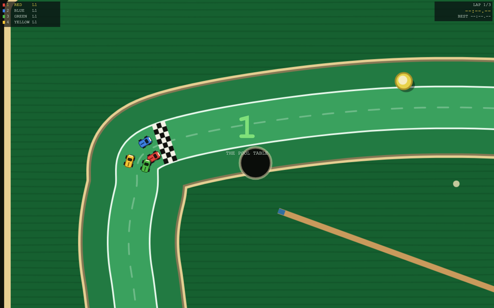
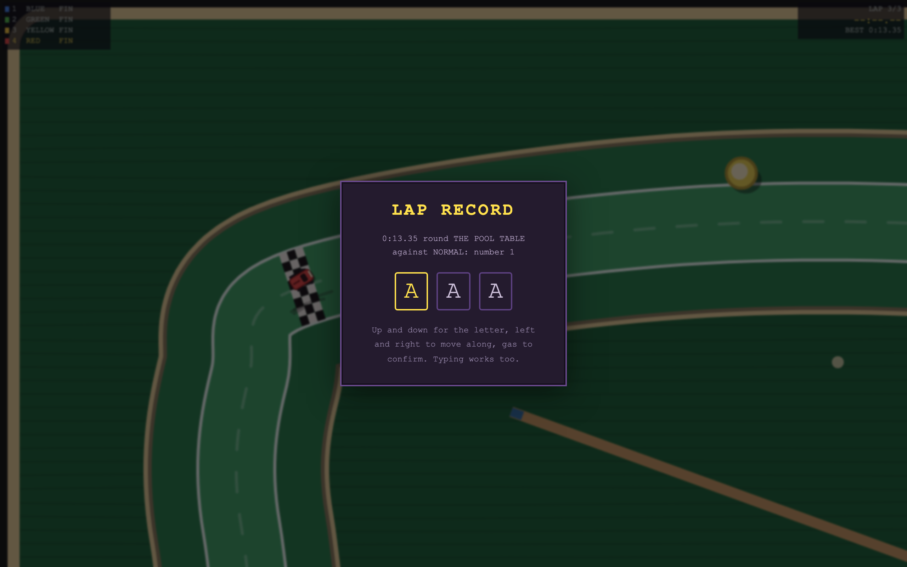

# WebRacing

Top-down arcade racing in the browser, in the spirit of the 16-bit tabletop
racers: tiny cars on a kitchen table, a camera that zooms out to hold the field,
and a hand that reaches in and picks you up when you fall a screen behind.
**1 player against the CPU**, **2 to 4 round one keyboard and a couple of
gamepads**, or **up to four online** with a four-character room code.

Every lap is timed, and a clean one goes on a shared record board — per table,
quickest first. That is what the game is actually for. The race is how you find
out whether you are quick; the board is why you go again.

No dependencies, no build step. HTML, CSS and JavaScript exactly as the browser
receives them.


It is the third game built this way, after
[websoccer](https://github.com/markclausing/websoccer) and
[webtennis](https://github.com/markclausing/webtennis), and the three share their
plumbing — see [Shared with the others](#shared-with-the-others).

## Getting started

```bash
git clone https://github.com/markclausing/webracing.git
cd webracing
npm start
```

Then open http://localhost:5173/. There is no `npm install`; there are no
packages to install.


## Controls

|                  | Player 1 (red) | Player 2 (blue) |
| ---------------- | -------------- | --------------- |
| Accelerate       | `W`            | `↑`             |
| Brake / reverse  | `S`            | `↓`             |
| Steer            | `A` `D`        | `←` `→`         |
| Also accelerate  | `Space`        | `Enter`         |
| Pause            | `Esc`          |                 |

Gamepads work without being set up. The first two share a car with the two
keyboard players, and a third and fourth pad each get a seat of their own — so
four people can race with two on the keys and two on pads, and the menu says
which car is whose.

On a phone you get a stick and two buttons, and the camera is fitted into the
space above them rather than behind them: a thumb parked over the corner you are
about to arrive at is no way to drive. GAS is the big one, because it is held for
the whole race; BRAKE sits above and inside it, where a stab can reach it without
letting go of the throttle.


## How it drives

There is one trick, and everything else follows from it.

**The brake takes most of the grip with it.** The car has a direction it is
travelling and a direction it is pointing, and they are not the same thing — that
difference is the drift. Ordinarily the tyres pull it back to nothing in about
four tenths of a second. On the brake they take nearly two seconds, so a stab of
it going into a hairpin steps the back out and points you at the exit. Come off
it and the car hooks up again.

**A slide is not free.** Scrubbing sideways takes speed out of the car in
proportion to how far sideways it is going, so the fastest way round a corner is
not the most spectacular one. The tyres tell you: the noise is the same number
the simulation is using.

**The nose comes round less at speed.** A car that turns as sharply at 340 as at
30 spins on the spot, which is how a shopping trolley drives. So the rate falls
away with speed — flickable at the bottom of the range, calm enough at the top
that a straight is a straight — and it stops altogether when you are parked.

**Bump people.** Cars bounce off each other hard, and there is nothing in the
rules about it. A shove at the right moment puts somebody in the milk, over the
edge of the table, or into a pocket.


## The rules



**Three laps**, or two, or five. First over the line wins; whoever is still out
there is classified where they were, because somebody has to be fourth and making
three cars drive an extra lap so a scoreboard can be filled in is how a
two-minute game becomes a five-minute one.

**Fall a screen behind and you are scooped up.** A hand reaches in, picks you
off the table and puts you back just behind the pack. It costs you the lap you
were on and every record it might have been; it does not cost you the race. That
is the whole reason the game stays close, and it is why a player who puts the
controller down cannot stall a race for three other people.

The distance is measured **along the road, not across the screen**, and that is
not a detail. What you can see depends on the size of your window, and the window
is not the same size on two machines: a rule that read from it would have two
players disagreeing about who had dropped, and the race would come apart. The
camera is clamped to the same distance instead, so what you see matches what the
game decided, and anybody who does not fit gets an arrow at the edge of the
screen.

**Off the table is worse than behind.** A second and a half standing still while
everybody goes past. Two of the four tables have rails and you bounce off them;
two do not, and running wide is the end of your lap.


## The tables

Four, and they are the only thing that changes between races. The cars do not —
they cannot, because the board at the end is a list of lap times and a lap time
means nothing if the red car was quicker than the blue one before anybody turned
a wheel. Variety lives in the table instead: how wide the road is, what happens
when you leave it, and how much of the surface is trying to throw you off.

| | | |
| --- | --- | --- |
| **The breakfast table** | polished wood, no rails | a spill of milk on the fast left-hander, and crumbs on the entry to two more |
| **The pool table** | cushions all the way round | six pockets, set just off the racing line, so they only collect you if you run wide |
| **The garden path** | wet paving, no rails | mud where the hose has been, puddles, and a lawn that costs you a second every time you touch it |
| **The desk** | books for barriers | the tightest of the four, a hairpin round the mug, and coffee on the exit |

A table is a handful of control points and a few nouns. Everything else — where
the road is, how far off it you are, which way it goes next, who is in front,
where to put a car that has fallen off, and what the CPU should be steering at —
is worked out from the one smooth loop that runs through them. That is why there
is no tile map: a grid gives you the surface cheaply and nothing else, and laps,
positions and the whole idea of being a screen behind would each need their own
answer.

## The lap record board

Ten per list, quickest first, kept in your browser and merged with everybody
else's through the relay. Two devices that have never seen each other's laps both
post their own board and both come away with the same one.

There is a list per table, because a lap of the pool table and a lap of the desk
are not comparable and never will be. There is also **a list per set of
opponents** — EASY, NORMAL, HARD, and online — and that one is worth being
precise about, because the obvious reading of it is wrong.

**The CPU setting does not touch your car.** Grip, acceleration and top speed are
identical on EASY and HARD; what varies between races is the table, not the
level. Measured with one fixed driver over ten seeds and all four tables, the
best lap moved by at most 0.07 of a second between the three settings, and not
consistently in either direction:

| | vs EASY | vs NORMAL | vs HARD |
| --- | --- | --- | --- |
| the breakfast table | 12.18s | 12.20s | **12.13s** |
| the pool table | 13.35s | 13.35s | 13.35s |
| the garden path | 14.50s | 14.50s | **14.48s** |
| the desk | 17.75s | 17.75s | 17.75s |

What the setting does change is the traffic — clear air 96%, 81% and 91% of the
time, and 0, 25 and 17 bumps a race — and traffic can only ever cost you time,
because there is no slipstream in this game and another car is never a help. So
the lists are not measuring how good your car was. They are keeping laps set in
clear air apart from laps set in a fight, which is the only honest thing to do
with them on one board.

Online is a list of its own because it has to be. An online race has no CPU
setting at all — every car is a person — and filing those laps under whichever
level the menu happened to be showing would be writing down something untrue.

A record has to be a **clean lap**. Falling off, being scooped up, driving into a
pocket or crossing the line the wrong way all void the lap you are on — the clock
keeps running, the record does not. That is the difference between a board worth
racing against and a list of times set by cutting the corner.

The board in the menu is always the one you would be racing for: pick a table,
pick your opponents, and the list under them is the list your next lap goes on.

Three letters, the way the cabinet asked for them, driven by the game's own
controls so it works on a phone without throwing a keyboard over the screen.




## Online

One player opens a race and passes on the four-character code; up to three others
enter it. Four boxes fill up in the menu as they arrive, and whoever opened it
picks the table and starts when there are enough.

It is **lockstep**: every machine runs the same deterministic simulation and
sends the others only its own buttons — never positions, never lap times. Input
for tick T goes out a few ticks early so it arrives before it is needed; if it is
not there anyway, everybody waits rather than guessing, so nobody can drift apart
from anybody else. The delay tunes itself upwards for whoever needs it, and every
machine compares a hash of the whole race once a second, so a desync is caught
rather than silently played out.

With four players a stall is three times as likely as it was in the two-player
games. The honest answer to that is: it is, and this is the cost of a netcode
where nobody can be given an advantage by their connection. What takes the edge
off it is that a player who actually disconnects stops being waited for — their
car carries on with nothing pressed, which every machine does identically, and
three people do not lose their race because a fourth had to answer the door.

The seat a message came from is stamped by the relay rather than named by the
sender, because a client that could name its own seat could drive somebody else's
car.

Online needs a server. `npm start` gives you one; for playing with people who are
not on your network there is a Cloudflare Worker in `worker/` — free, and about
two commands. This copy already points at one:

```js
// src/config.js
export const DEFAULT_RELAY = 'wss://webracing.vibecoach.workers.dev';
```

A `?relay=` in the address always wins, so you can point a tab at a different one
without editing anything, and on localhost the page assumes whatever served it.
See [worker/README.md](worker/README.md) for deploying your own.

## The CPU

Three settings, and what separates them is measured rather than guessed.

The strongest lever is **how far up the road it is reading**, in pixels: read far
enough ahead and you are already turning in when the corner arrives, which is
most of what makes a driver look quick. The second is **how far off the line it
wanders**, and that wander is allowed to take it off the road — a car that cannot
make a mistake is not an opponent, it is a metronome. The third is **how much of
the warning it acts on**: how late it gets off the throttle for a corner it has
already seen.

It steers at a point up the road and it brakes for how much the road has turned
by the time it gets there. That is all. It is the same button mask a keyboard
produces, so there is one driving model rather than two — a car that understeers
understeers for everybody — and a headless test can fill all four seats and run a
whole race in a few milliseconds.

## Tests

```bash
npm test              # the lot
npm run test:sim      # whole races headless: the rules, the geometry, the board
npm run test:net      # four real clients through the real relay
npm run test:shared   # the shared files, against the other two games
```

The screenshots above are taken by a browser rather than by hand:

```bash
node tools/screenshot.js
```

It starts the relay, drives a headless Chrome over the DevTools protocol, races a
real race in it and photographs the interesting moments - including three laps it
drives itself onto the record board, so the board in the picture is a board
rather than an empty table. A screenshot taken by hand is out of date the day
after somebody changes the colour of the road; one that can be retaken with a
single command tends actually to be retaken.

The app icons are drawn the same way, by `node tools/make-icons.js`. A PNG is a
header, one zlib stream and a trailer, and node has zlib built in - so they are
written by hand rather than pulled from a library, they take their colours from
`constants.js`, and running it again produces the same bytes.

`test:sim` checks the things that are cheap to get subtly wrong: that the loop
through each table is evenly spaced enough to search and never runs into itself,
that a race always reaches a finish, that a player who does nothing at all cannot
hang it, that a lap stops being a record the moment anything happens to it, and
that a car put back on the road is put back *inside* the rule rather than on the
edge of it.

That last one is a regression test for a real bug. The last car on the road is
allowed to be a whole screen behind; dropping somebody back behind *that* put
them outside the limit, so they were scooped up again on the next tick, and
again, and again. At a high input delay one car was picked up seven times in
forty-five seconds and never completed a single lap.

`test:net` starts the real relay, connects four real clients, races a whole race
with scripted input and checks that all four machines computed the same race. It
also checks the two things that only go wrong once there are more than two
players: that a message reaches everybody in the room rather than "the other
one", and that the seat stamped on it is the one the relay assigned.

## Shared with the others

Seven files are identical in all three games — the input mask, the touch
controls, the room protocol, the three-letter name entry, the formant speech
synthesiser, the WebSocket implementation and the maths. They are shared by being
the same file in every repository rather than by a package, because none of the
three has a build step and none is going to grow one for this.

```bash
node tools/sync-shared.js          # are they still the same?
node tools/sync-shared.js --pull   # take the others' copy
node tools/sync-shared.js --push   # send this one back
```

It runs as part of `npm test`, so a change on one side shows up as a failing test
on the others rather than as a mystery six months later.

The list is shorter than the one webtennis keeps, and the four that fell off it
are each a place where this genuinely is a different game rather than the same
one with new pictures:

- **the record board** — theirs is a scoreline, where bigger is better and a
  defeat is not news. A lap time is smaller-is-better, has no opponent in it, and
  is kept per table rather than per difficulty.
- **the transport** — two players became four, so "the peer" became "the other
  seats" and a stall is anybody's fault rather than one particular person's.
- **the relay** and **the Worker** — rooms hold four, and the seat a message came
  from is stamped by the server rather than claimed by the sender.

Nothing that knows what sport it is gets shared. The simulation, the tables, the
sounds and the words are each game's own — a shared file full of `if (racing)`
would be worse than two files.

## The sound

An original chiptune, an engine, and the noises a toy car makes on a table, all
synthesised in the browser. Nothing is loaded; there is no audio file.

The engine is the one that came with this game, and it is the only sound here
that is a state rather than an event: a sawtooth and a square a fifth apart
through a lowpass, running from the green light to the flag, with its pitch set
by your speed, its filter by your throttle and a loop of filtered noise behind it
that opens as the tyres let go. There are two "gears", which is all it takes —
without them the note simply rises forever and the car sounds like a vacuum
cleaner. It is also the only readout of how fast you are going, because a
speedometer on a game about a toy car would be absurd and you can hear it anyway.

The commentator is the same formant synthesiser websoccer uses, saying rather
less. The engine is the sound of this game, and a voice over the top of every
corner is a voice you turn off.

## What is not there yet

- **No jumps.** Ramps and a ball that leaves the table would be the most Micro
  Machines thing in the game and they need a third axis the simulation does not
  have.
- **No weapons, no power-ups, no shortcuts.**
- No championship: every race stands on its own, and the board is the only thing
  that carries over.
- The CPU is the same driver on all four tables. It does not know that a pool
  table has cushions worth leaning on.
- Only four tables, and no track editor, though a track is fifteen numbers and
  adding a fifth is a small job — see `src/game/tracks.js`.
- No time trial: there is no way to go out on your own and just chase a time,
  which is the mode a lap record board really wants.
- No title screen art. The menu sits over the table you are about to race, which
  will do for now.
- The camera zooms out and stops. On a phone held upright, four cars at full
  spread are small.

## Licence

[MIT](LICENSE).

An original tribute to the top-down racing games of the nineties: no code,
artwork or other parts of any existing game, and no affiliation with their makers
or rights holders.
