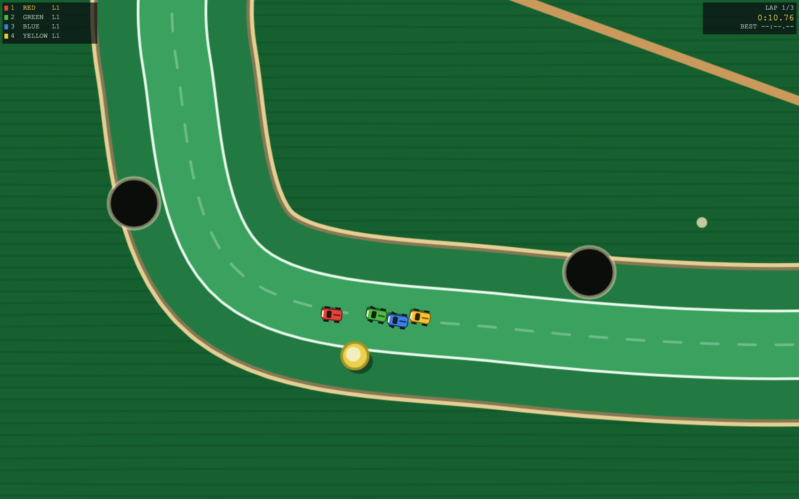
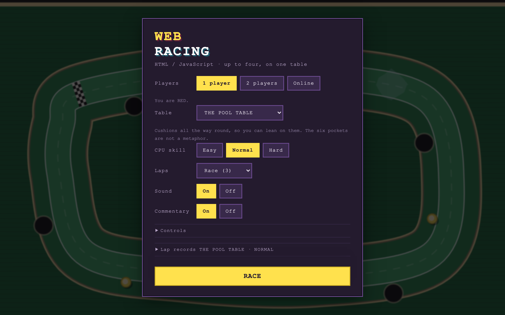
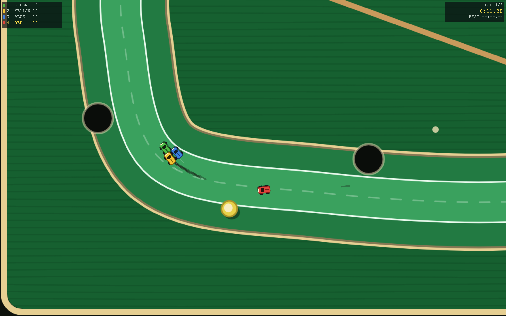
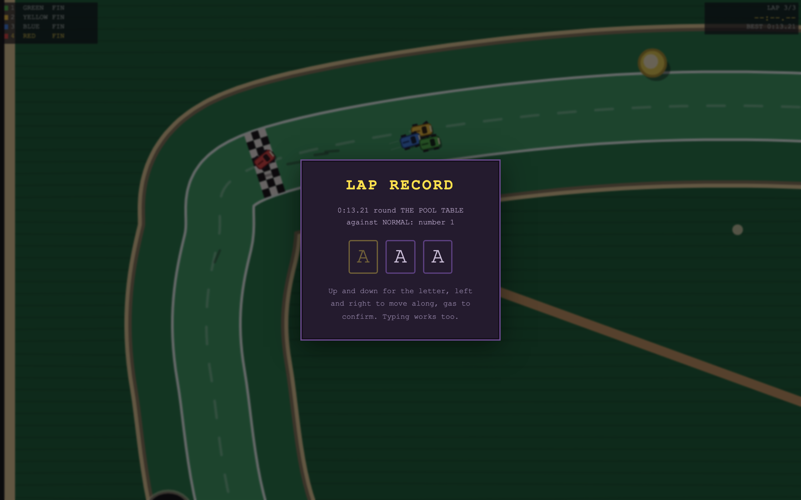
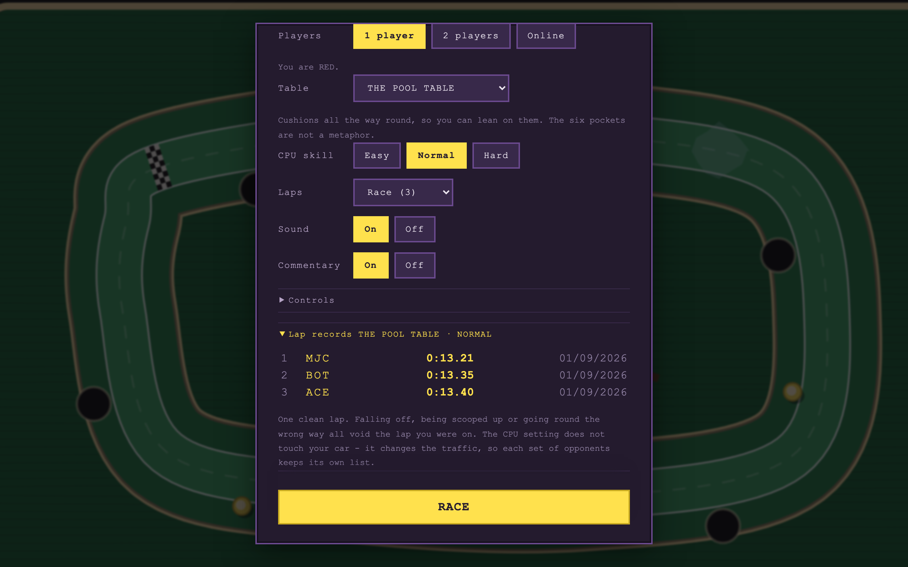
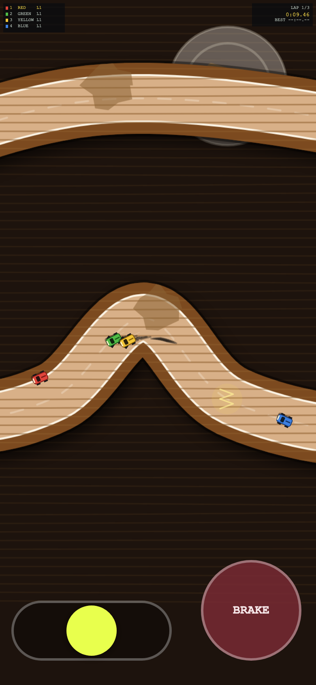

# WebRacing

### ▶ [Play it](https://markclausing.github.io/webracing/)

Top-down arcade racing in the spirit of the 16-bit tabletop racers: tiny cars on
a kitchen table, a camera that zooms out to hold the field, and a hand that
reaches in and picks you up when you fall a screen behind. **1 player against the
CPU**, **2 to 4 round one keyboard and a couple of gamepads**, or **up to four
online** with a four-character room code.

Every clean lap is timed and goes on a shared record board. The race is how you
find out whether you are quick; the board is why you go again.

No dependencies, no build step — HTML, CSS and JavaScript exactly as the browser
receives them. It is the third game built this way, after
[websoccer](https://github.com/markclausing/websoccer) and
[webtennis](https://github.com/markclausing/webtennis).



## Running it yourself

```bash
git clone https://github.com/markclausing/webracing.git
cd webracing && npm start
```

Then open http://localhost:5173/. There is no `npm install`.



## Controls

|                 | Player 1 (red) | Player 2 (blue) |
| --------------- | -------------- | --------------- |
| Accelerate      | `W` / `Space`  | `↑` / `Enter`   |
| Brake / reverse | `S`            | `↓`             |
| Steer           | `A` `D`        | `←` `→`         |
| Pause           | `Esc`          |                 |

Every key can be changed in the menu. Gamepads need no setting up: the first two
share with the keyboard players, a third and fourth get seats of their own.

On a phone the car drives itself and the one button is the brake, because
holding a throttle for two minutes with one thumb while steering with the other
leaves nothing spare — and what you actually decide, corner by corner, is when to
come *off* the power. You can hold it yourself instead, from the menu.

Steering is the whole bottom-left corner, and it is **relative**: wherever your
thumb lands is straight ahead, and you steer by moving from there. There is no
centre to find, which matters because you cannot feel one through glass. It is
proportional too — the simulation still takes one bit per direction, because that
bitmask is what goes over the wire and what makes a lap set on a phone comparable
with one set on a keyboard, so the phone presses it for a share of the ticks
instead of all of them and the car settles at that share.

There is also a **steering aid**, on by default, in two strengths. You say which
way and it decides how much: a little lock where the corner wants a lot becomes a
lot, a lot where it wants a little becomes a little, and asking the wrong way
winds you back towards straight rather than turning the wheel for you. It is
aimed at the thing that actually makes a phone hard — judging how far to move a
thumb you cannot feel.

**A hand that is not on the wheel gets nothing**, at any strength, and that part
is not negotiable. The first version helped hardest when you were asking for
least, which felt lovely and was an autopilot: measured over 24 races with nobody
touching the wheel it completed 2.9 laps of 3, finished third of four and set a
13.18s lap — quicker than the thumb it was meant to be helping. Laps like that
would have gone on the record board. With a thumb on it, the aid takes falling
off the road from 4.0 a race to 2.8 and laps completed from 1.6 to 2.6.

All of this is input, not physics. The aid, the automatic throttle and the
part-pressed steering all decide *what gets pressed*; the car itself is identical
on every device, because the netcode and the record board both rest on that.

The camera is bounded by how big a car should be rather than by how much table
should fit, so a phone gets the same size of picture as a laptop and simply sees
less road either side of it.

## How it drives

- **The brake takes most of the grip with it.** A stab of it into a hairpin steps
  the back out and points you at the exit. That is the trick the game is built
  on.
- **A slide is not free.** Scrubbing sideways scrubs speed, so the fastest way
  round is not the most spectacular one. The tyres tell you.
- **The nose comes round less at speed**, and not at all when you are parked.
- **Bump people.** There is nothing in the rules about it, and the CPU knows.



## Keeping the race together

Three things stop a good driver being alone by the end of lap one, and all three
work the same way for the CPU as for you.

**The tow** is worth 7% right behind somebody, fading to nothing by ten car
lengths back or a car's width off their line. Small on purpose: it should not
make following easy, only stop the leader vanishing.

**The turbos** are dropped a short way ahead of a car that is not leading, and
only where the leader has already gone past. They fade in four seconds — so the
further back you are the more you find, and out in front you never meet one.
Worth 28% for a second and a half, which is a straight's worth and nothing in a
corner.

**The squeeze** is the CPU leaning on whoever is alongside and pushing them
towards the edge. Off on EASY, wound up above it. It is aimed at whoever is
there, not at you: the simulation knows which cars are people and deliberately
does not look.

Measured with one scripted driver against three HARD over 100 races — how long
before the leader is more than a tow clear and stays clear:

| | breaks clear after | never breaks clear |
| --- | --- | --- |
| a clearly quicker driver | 14.8s → **23.1s** | 0 → **15 of 100** |
| a driver at the CPU's pace | 26.7s → 26.0s | 10 → **47 of 100** |

At parity, half the races now stay together to the flag. Somebody genuinely
quicker still wins — they should — but it takes them a lap and a half longer to
be on their own.

## The rules

**Three laps**, or two, or five. First over the line wins; everybody still out
there is classified where they were.

**Fall a screen behind and you are scooped up** and put back just behind the
pack. It costs you the lap you were on, not the race — and it is why one player
putting the controller down cannot stall a race for three others. The distance is
measured **along the road, not across the screen**: what you can see depends on
your window, and a rule that read from that would have two players disagreeing
about the same race.

**Off the table is worse.** Two tables have rails and you bounce; two do not.



## The tables

Four, and they are the only thing that changes between races — the cars are
identical, because a lap time means nothing if the red car was quicker before
anybody turned a wheel.

| | | |
| --- | --- | --- |
| **The breakfast table** | polished wood, no rails | milk on the fast left-hander, crumbs into two more |
| **The pool table** | cushions all round | six pockets, just off the racing line |
| **The garden path** | wet paving, no rails | mud, puddles, and a lawn that costs you a second |
| **The desk** | books for barriers | the tightest, with a hairpin round the mug |

A table is a handful of control points. Everything else — the surface, the laps,
the positions, where to put a car that fell off, what the CPU steers at — is
measured against the one smooth loop that runs through them. That is why there is
no tile map: a grid gives you the surface and nothing else.

## The lap record board

Ten per list, quickest first, kept in your browser and merged with everybody
else's through the relay. There is a list per table, and a list per set of
opponents — EASY, NORMAL, HARD and online.

That last one is easy to misread. **The CPU setting does not touch your car.**
Grip, acceleration and top speed are identical on EASY and HARD; measured with
one fixed driver over ten seeds and four tables, the best lap moved by at most
0.07 of a second between the settings, with no ordering. What the setting changes
is the traffic — and traffic cuts both ways, since a tow makes you quicker and a
HARD driver leaning on you puts you in the milk. The lists keep laps set in clear
air apart from laps set in a fight.

Online is its own list because an online race has no CPU setting at all, and
filing those laps under whichever level the menu was showing would be writing
down something untrue.

A record has to be a **clean lap**: falling off, being scooped up or going round
the wrong way all void the lap you are on. The board in the menu is always the
one you would be racing for.



## Online

One player opens a race and passes on the code; up to three others enter it.
Whoever opened it picks the table and starts when everybody is in.

It is **lockstep**: every machine runs the same deterministic simulation and
sends only its own buttons. Input goes out a few ticks early; if it has not
arrived, everybody waits rather than guessing. The delay tunes itself, and every
machine compares a hash of the race once a second so a desync is caught rather
than silently played out. A player who disconnects stops being waited for — their
car carries on with nothing pressed, which every machine does identically.

The seat a message came from is stamped by the relay, not named by the sender: a
client that could name its own seat could drive somebody else's car.

`npm start` gives you a relay. The public game points at a Cloudflare Worker
instead — free, about two commands, see [worker/README.md](worker/README.md).



## Tests

```bash
npm test              # the lot
npm run test:sim      # the rules, the geometry and the board, headless
npm run test:net      # four real clients through the real relay
npm run test:shared   # the shared files, against the other two games
```

`test:sim` checks the things that are cheap to get quietly wrong: that a race
always reaches a finish, that a player who does nothing cannot hang it, that a
lap stops being a record the moment anything happens to it, and that a car put
back on the road is put back *inside* the rule rather than on the edge of it —
that last one a regression test for a real bug, where a dropped car was
reinstated just outside the limit and scooped up again on the next tick, over and
over.

`test:net` starts the relay, connects four clients and checks all four computed
the same race — including the two things that only break with more than two
players: that a message reaches everybody, and that the seat on it is the one the
relay assigned.

The screenshots and the icons are generated too, by `node tools/screenshot.js`
(headless Chrome, driving a real race) and `node tools/make-icons.js` (a PNG is a
header, a zlib stream and a trailer, and node has zlib built in).

## Shared with the others

Seven files are identical in all three games — the input mask, the touch
controls, the room protocol, the name entry, the speech synthesiser, the
WebSocket implementation and the maths. Shared by being the same file in each
repository rather than by a package, because none of the three has a build step.

```bash
node tools/sync-shared.js          # are they still the same?
node tools/sync-shared.js --pull   # or --push
```

It runs as part of `npm test`, so a change on one side fails the build on the
others rather than becoming a mystery six months later. Nothing that knows what
sport it is gets shared: a shared file full of `if (racing)` would be worse than
two files.

## The sound

An original chiptune, an engine and the noises a toy car makes, all synthesised
in the browser — nothing is loaded. The engine is the only sound here that is a
state rather than an event: two oscillators through a lowpass, pitch from your
speed, filter from your throttle, tyre noise as the back steps out. It is also
the only speedometer, because a speedometer on a toy car would be absurd.

## What is not there yet

- No jumps. The most Micro Machines thing missing, and it needs a third axis.
- No weapons, no championship, no track editor — though a track is fifteen
  numbers, see `src/game/tracks.js`.
- No time trial, which is the mode a lap record board really wants.
- The CPU's steering is one bit, like a keyboard, so the squeeze only decides
  anything where the driver was near neutral. Mid-corner the road is already
  asking for full lock and the lean is invisible.

## Licence

[MIT](LICENSE).

An original tribute to the top-down racing games of the nineties: no code,
artwork or other parts of any existing game, and no affiliation with their makers
or rights holders.
